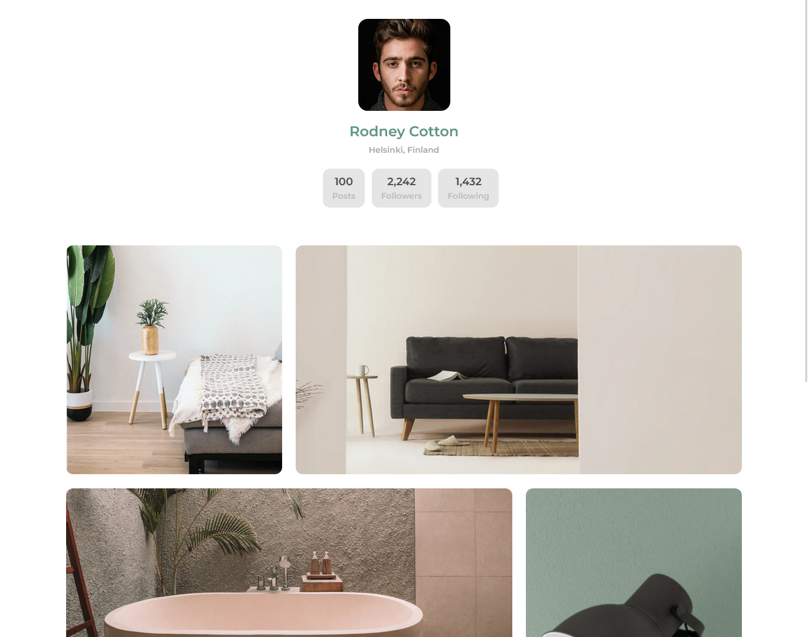

<!-- Please update value in the {}  -->

<h1 align="center">{My Gallery Page}</h1>

   Solution for a challenge from  <a href="http://devchallenges.io" target="_blank">Devchallenges.io</a>.

  <h3>
    <a href="https://my-gallery-page-by-sotun.netlify.app/">
      Demo
    </a>
     | 
    <a href="https://github.com/Sotun-1010/my-gallery-page">
      Solution
    </a>
     | 
    <a href="https://devchallenges.io/challenges/gcbWLxG6wdennelX7b8I">
      Challenge
    </a>
  </h3>

<!-- TABLE OF CONTENTS -->

## Table of Contents

- [Overview](#overview)
  - [Built With](#built-with)
- [Features](#features)
- [Contact](#contact)
- [Acknowledgements](#acknowledgements)

<!-- OVERVIEW -->

## Overview

Introduce your projects by taking a screenshot or a gif. Try to tell visitors a story about your project by answering:

- Where can I see your demo? You can find my demo [here](https://my-gallery-page-by-sotun.netlify.app/)
- What was your experience? It was quite intriguing
- What have you learned/improved? Improved my knowledge of responsiveness, Flex-box and CSS grid
- Your wisdom? :) keep PUSHing

### Built With

<!-- This section should list any major frameworks that you built your project using. Here are a few examples.-->

- [HTML] (<https://developer.mozilla.org/en-US/docs/Web/HTML/>)
- [CSS] (<https://developer.mozilla.org/en-US/docs/Web/CSS/>)

## Features

<!-- List the features of your application or follow the template. Don't share the figma file here :) -->

This application/site was created as a submission to a [DevChallenges](https://devchallenges.io/challenges) challenge. The [challenge](https://devchallenges.io/challenges/gcbWLxG6wdennelX7b8I) was to build an application to complete the given user stories.

## Acknowledgements

<!-- This section should list any articles or add-ons/plugins that helps you to complete the project. This is optional but it will help you in the future. For exmpale -->

- [Steps to replicate a design with only HTML and CSS](https://devchallenges-blogs.web.app/how-to-replicate-design/)
- [Node.js](https://nodejs.org/)
- [Marked - a markdown parser](https://github.com/chjj/marked)

## Contact

- GitHub [@Sotun-1010](https://github.com/Sotun-1010)
- Twitter [@O_G_Sotun](https://twitter.com/O_G_Sotun?t=kRiO1YNhYKn8NJJnxTZ42A&s=03)